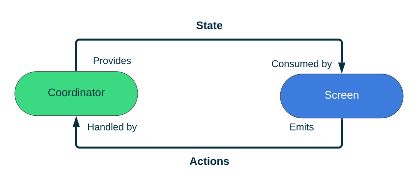
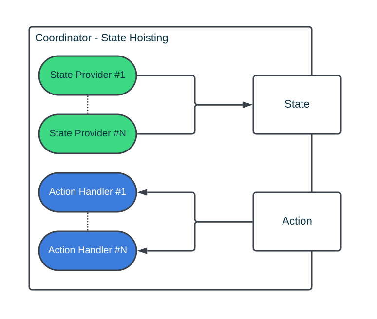
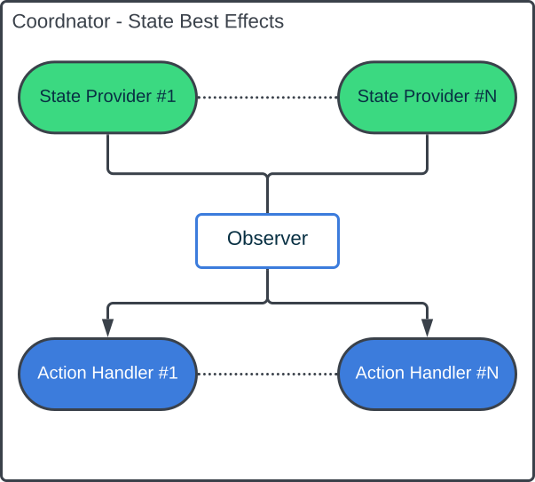

# Coordinator
The coordinator the is the main component in our architecture. Every statefull Composable component, such as `LazyRow` and `Scaffold` has a state that drives how the component works, similiary, you can think of a Coordinator as the state of your flow or feature.

Following figure demonstrates the flow of the data and how each component interacts with each other.


This a simplistic version of whats going on. Looking closely, when we say the action is handled by the `Coordinator` is that will delegate this action some other component. Similiraly, the `Coordinator` doesn't store any state but rather relies other components to provide it. Let's call them State Providers and Action Handlers

## State Providers & Action Handlers
**The State Provider** is the source of truth of some component. We can have multiple of those. The `Coordinator` then acts as a mediator allowing us to combine the states or expose partial states. 


The most common example of the State Provide can be the android `ViewModel` that exposes the state of our business logic. However, we can also consider other composable components state as a state provider, for example: `PagerState`


```kotlin
data class ViewModelState(
    val items: List<Item>
)

data class ScreenState(
    val currentItem: Item?
)

class ExampleCoordinator(
    val viewModel: ViewModel,
    val pagerState: PagerState
 ) {
    val stateFlow = combine(
        viewModel.stateFlow,
        pagerState.currentPagerFlow()
    ) { uiState, currentPage } {
        ScreenState(uiState.items[currentPage])
    }
 }
```

**The Action Handlers** is something that can mutate our State. Very often the Action Handler can also act as the State Provider. 

In summary, the main idea of the Coordinator is to "coordinate" different State Providers and Action Handlers to perform some user journey


```kotlin
// coordinator scope
class LocationCoordinator(
    val permissionState: PermissionState,
    val mapState: MapState
)
fun focusOnUserLocation() {
    if (permissionState.isGranted) {
        mapState.focusOnCurrentLocation()
    } else {
        permissionState.launchPermissionRequest()
    }
}
```

Following diagram demonstrates this in a more generic way




## React to State Changes - Side effects
Because of the Reactive nature of Compose handling something that we consider one shot events can be bit tricky. 

When inside `@Composable` we have access to different effects so we can do something only when certain conditions are met without worrying about re-compositions. 

But since we have `Coordinator` we can let it do that for us as well. Because the `Coordinator` is outside of Composable scope and doesn't get re-created due to the recompositions we can easily subscribe to the state changes and react to them in more straight forward fasion, just like we would normally do in our `ViewModel`


```kotlin
class Coordinator(
    val viewModel: ViewModel,
    val context: Context,
    val scope: CoroutineScope
) {
    init {
        viewModel.errorFlow()
            .onEach { msg -> 
                context.showToast(msg) 
                viewModel.dismissError()
            }
            .launchIn(scope)
    }
}
```

Again this is basically the same thing we would with the Action coming in from the `Screen`, except now the source of this interaction is the **State Provider** it self and it doesn't leave the `Coordinator` and goes directly to the **Action Handlers**


