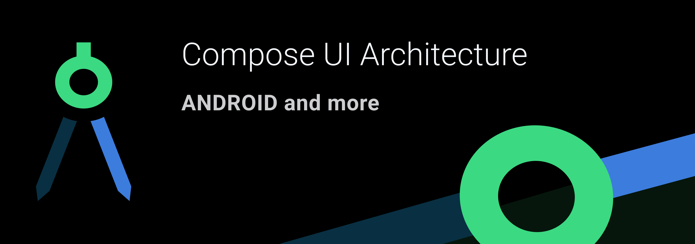

This repository serves as the opinionated knowledge hub that contains component descriptions best practices and tools for  developing complex UI features using Compose

##  🚧 Work in Progress ##
These pages are still work in progress and might contain spelling errors, inconsistencies and unfinished pages. 

## Overview 
Featured approach has following components

- State - The static state of our Screen
- Actions - Set of **user** interactions available on the screen
- Screen - Stateless representation of our feature UI, consumes state and emits Actions
- Coordinator - Provides the state and consumes Actions. Coordinates different state providers and action handlers to fulfill user journey
- Route - Main entry point to our Screen. Remember the coordinator and actions. Collects the state

## Resources
The list of resources associated with Compose UI Architecture

### Articles

### Tools

**Jetpack Compose UI Archicture Templates IDE Plugin**

Android studio plugin that facilitates creating new Jetpack Compose powered UI screens for android. 

- Provides a set of templates that can be used to create a set components described here 
- Provides a set of Live Templates that can to write Compose UI code faster

<iframe width="245px" height="48px" src="https://plugins.jetbrains.com/embeddable/install/19034"></iframe>